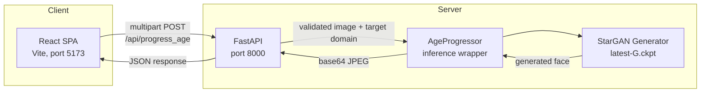
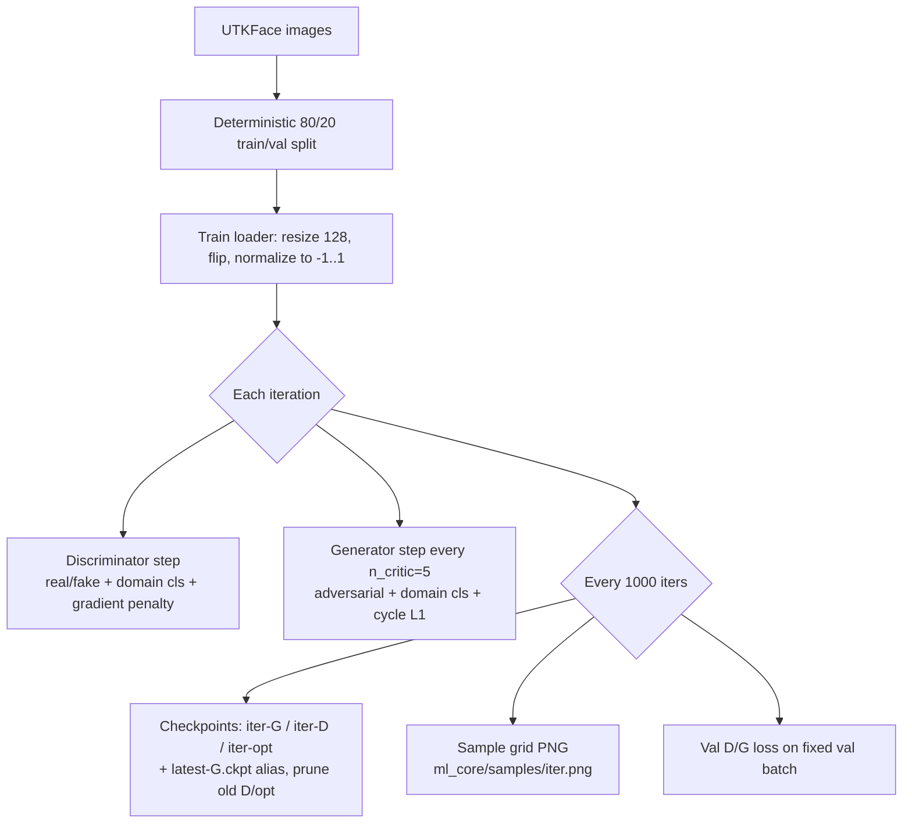

# GAN-Based Facial Age Progression and Regression

[](https://github.com/ojas3010/facial-age-progression-gan/actions/workflows/ci.yml)


[](LICENSE)

Identity-preserving facial age progression and regression using a multi-domain conditional GAN (StarGAN topology trained with the WGAN-GP objective) on the UTKFace dataset. A single generator handles all six age domains — no per-domain models. The trained model is served through a FastAPI backend and consumed by a React single-page dashboard.

## Contents

- [Architecture](#architecture)
- [Repository Structure](#repository-structure)
- [Setup](#setup)
- [Running the Application](#running-the-application)
- [API Reference](#api-reference)
- [Training](#training)
- [Model Details](#model-details)
- [Testing](#testing)
- [Continuous Integration](#continuous-integration)
- [License](#license)

## Architecture



The backend loads `ml_core/models/latest-G.ckpt` once at startup (FastAPI lifespan). Every request is validated (MIME type, payload size, domain range, decoded image format and dimensions) before touching the model. Uploads are rotated upright from their EXIF orientation, then scaled and center-cropped to a 128 × 128 square (training faces are square crops, so squashing a non-square photo would distort it). Inference runs in a worker thread, on GPU when CUDA is available, otherwise CPU.

## Repository Structure

| Path | Purpose |
|------|---------|
| `ml_core/model.py` | StarGAN Generator and Discriminator definitions |
| `ml_core/dataset.py` | UTKFace loader; maps age to 6 discrete domains |
| `ml_core/train.py` | WGAN-GP training loop: checkpointing, resume, sample grids |
| `ml_core/inference.py` | `AgeProgressor` — loads checkpoint, runs single-image inference |
| `backend/main.py` | FastAPI service with input validation and CORS |
| `frontend/` | React 19 + Vite SPA — drag-and-drop upload, result download, latency badge |
| `tests/` | pytest unit and API tests, standalone training smoke test |
| `.github/workflows/ci.yml` | CI: backend test job + frontend lint/build job |

### Age Domains

| Domain | Age range |
|--------|-----------|
| 0 | 0–10 |
| 1 | 11–20 |
| 2 | 21–30 |
| 3 | 31–40 |
| 4 | 41–50 |
| 5 | 51+ |

## Setup

Requires Python 3.12+ and Node 22+.

```bash
python -m venv .venv
source .venv/bin/activate            # Windows: .venv\Scripts\activate
pip install -r backend/requirements.txt
```

GPU users: install the CUDA build of PyTorch from [pytorch.org](https://pytorch.org) instead of the default CPU wheel.

## Running the Application

**Backend** (from repo root):

```bash
python -m uvicorn backend.main:app --port 8000
```

Model weights are loaded from `ml_core/models/latest-G.ckpt` at startup. Without a checkpoint the API still runs but produces noise output; `GET /` then reports `"model_loaded": false` and the dashboard shows **Weights: UNTRAINED**.

**Frontend**:

```bash
cd frontend
npm install
npm run dev            # http://localhost:5173
```

The dashboard calls `http://localhost:8000` by default; set `VITE_API_URL` to point it elsewhere. Serving it from an origin other than `localhost`/`127.0.0.1` on ports 5173/4173 also requires adding that origin to the CORS list in `backend/main.py`.

## API Reference

### `POST /api/progress_age`

Multipart form request.

| Field | Type | Constraints |
|-------|------|-------------|
| `file` | image | JPEG / PNG / WEBP, max 5 MB, max 50 megapixels |
| `target_age_group` | integer | 0–5 (see age domain table) |

The format is checked twice: the declared content type must be one of the three, and the bytes must actually decode as one of them (a GIF or TIFF sent as `image/png` is rejected). The output is a 128 × 128 JPEG.

**Success** — `200`:

```json
{ "status": "success", "image_base64": "<jpeg bytes, base64>" }
```

**Errors**:

| Status | Cause |
|--------|-------|
| 400 | Unsupported file type, payload over 5 MB, image over 50 megapixels, or corrupt/truncated image bytes |
| 422 | `target_age_group` outside 0–5 or not an integer |
| 500 | Model not initialized or inference failure |

### `GET /`

Health check. Returns `{"message": "Age Progression GAN API is running.", "model_loaded": true}`. `model_loaded` is `false` when no trained checkpoint was loaded, i.e. the generator is on random weights and output is noise.

## Training

Place UTKFace images (filename format `[age]_[gender]_[race]_[date].jpg`) in `ml_core/data/utkface`, then run from the repo root:

```bash
python ml_core/train.py
```

Every hyperparameter is a flag, so the command line is the record of what produced a checkpoint (`python ml_core/train.py --help` lists them all):

```bash
python ml_core/train.py --batch-size 16 --num-iters 200000 --seed 7
```

| Flag | Default | Notes |
|------|---------|-------|
| `--batch-size`, `--num-iters`, `--n-critic` | 8, 100000, 5 | |
| `--g-lr`, `--d-lr`, `--beta1`, `--beta2` | 1e-4, 1e-4, 0.5, 0.999 | Adam |
| `--lambda-cls`, `--lambda-rec`, `--lambda-gp` | 1, 10, 10 | loss weights |
| `--image-dir` | `ml_core/data/utkface` | |
| `--model-save-dir` | `ml_core/models` | sample grids go to a sibling `samples/` dir |
| `--log-step`, `--model-save-step` | 10, 1000 | |
| `--num-workers` | 4 | DataLoader workers |
| `--seed` | 42 | weight init, shuffle, augmentation; never the train/val split |
| `--keep-last` | 3 | D/optimizer checkpoint pairs kept for resume; `0` keeps all |

Architecture (image size, number of domains, residual blocks) is deliberately not a flag: a checkpoint with a different shape would not load in the backend.

`train.py` refuses to start without CUDA rather than silently crawling on CPU.

### Getting the dataset

UTKFace (Aligned & Cropped Faces, ~23k images) is distributed from the [UTKFace project page](https://susanqq.github.io/UTKFace/); mirrors also exist on Kaggle. Extract the `.jpg` files directly into `ml_core/data/utkface` — the loader parses the age from each filename and silently skips files that don't match the naming scheme.

Training 100k iterations at 128px requires a CUDA GPU (roughly a day on a modern consumer card); CPU training is impractical. Without local CUDA, clone the repo on Colab/Kaggle, train there with the same command, and copy the resulting `latest-G.ckpt` into your local `ml_core/models/` for serving. Those sessions are preemptible, so point `--model-save-dir` at persistent storage (e.g. a mounted Google Drive folder) and rerun the same command after a disconnect to resume.

`train.py` resolves its data and output paths relative to its own location, so it works from any working directory.

### Training pipeline



### Train/val split

The loader splits the dataset 80/20 with a seeded permutation over the sorted file list, so the split is reproducible across runs — resuming training keeps the same val set. The val pipeline omits the horizontal-flip augmentation. At every checkpoint save, D and G losses on a fixed val batch are logged (the D val loss omits the gradient-penalty term, which requires gradients). Logging only — there is no early stopping.

### Checkpoints and resume

Every 1,000 iterations, `ml_core/models/` receives:

- `{iter}-G.ckpt`, `{iter}-D.ckpt` — generator / discriminator weights
- `{iter}-opt.ckpt` — both optimizer states
- `latest-G.ckpt` — stable alias the backend loads

G checkpoints are kept forever (they are the deliverable and feed evaluation). D and optimizer checkpoints exist only for resuming, so all but the newest `--keep-last` (default 3) pairs are deleted after each save. A save is about 640 MB (G 34 MB, D 179 MB, Adam state 426 MB), so a 100k run takes about 5 GB instead of 64 GB.

Interrupted runs **resume automatically**, including Adam optimizer state — just rerun the same command. The resume point is the newest iteration with both a G and a D checkpoint. Each file is written to a `.tmp` name and renamed into place, in the order optimizer → D → G, so a run killed mid-save never leaves a truncated checkpoint or a half-written resume point; the next run falls back to the previous complete save.

Checkpoints from before the generator's InstanceNorm change (see [Model Details](#model-details)) still load, for both resume and serving.

### Sample grids

At every checkpoint, a fixed batch of 8 real images is translated to all 6 age domains and saved as `ml_core/samples/{iter}.png`. Each row is one source image: original in the first column, followed by domains 0–5. Useful for visually tracking generator quality across a run.

### Key hyperparameters

| Parameter | Value |
|-----------|-------|
| Image size | 128 × 128 |
| Batch size | 8 |
| Iterations | 100,000 |
| Generator / Discriminator LR | 1e-4 (Adam, β₁ 0.5, β₂ 0.999) |
| Critic steps per generator step (`n_critic`) | 5 |
| λ classification / reconstruction / gradient penalty | 1 / 10 / 10 |

## Model Details

**Generator** — StarGAN topology: the one-hot domain label is spatially replicated and concatenated with the input image channels. 7×7 entry conv → two stride-2 downsampling convs → 6 residual blocks (instance norm) → two transposed-conv upsampling layers → 7×7 output conv with tanh. Output is in [-1, 1], denormalized at inference.

Instance norm uses each image's own statistics in both training and inference (`track_running_stats=False`). With running stats tracked, `eval()` would switch to dataset-averaged statistics, so the served model would compute something different from what was trained, and from the training sample grids. Older checkpoints carry the now-unused running-stat buffers; `generator_state_dict()` in `ml_core/model.py` drops them on load.

**Discriminator** — PatchGAN with two heads: a real/fake patch map (WGAN critic output) and a domain classification head over the 6 age groups.

**Objective** — WGAN-GP adversarial loss with gradient penalty, auxiliary domain classification loss on both networks, and a cycle-consistency L1 reconstruction loss (translate to target domain, translate back, compare with source) that preserves identity.

## Testing

```bash
pip install pytest httpx
python -m pytest tests -v            # unit + API tests, a few seconds
python tests/smoke_train.py          # 15-iteration CPU training smoke test, ~1 min
```

The pytest suite covers:

- **Data**: age-group boundary mapping, dataset filename parsing (including corrupt names), the deterministic train/val split, and the empty-dataset error.
- **Model and inference**: one-hot encoding, generator/discriminator output shapes and bounds, generator train/eval equivalence, loading legacy and mismatched checkpoints, center-crop preprocessing, and end-to-end inference.
- **Checkpoints**: resume discovery (skipping incomplete saves and stray files), pruning, and atomic writes.
- **API validation**: health check and `model_loaded`, success path, bad MIME type, disallowed formats behind an allowed MIME type, out-of-range and non-integer domains, oversized payload and dimensions, corrupt and truncated images, EXIF orientation, and the model-not-initialized path.

The smoke test runs real training iterations on synthetic data. It asserts checkpoint writing, the `latest-G.ckpt` alias, optimizer-state resume, D/opt pruning, and resume after a save killed mid-write.

## Continuous Integration

Every push and pull request runs two jobs on GitHub Actions:

- **backend** — Python 3.12, CPU PyTorch, full pytest suite plus the training smoke test (checkpoint save + resume)
- **frontend** — Node 22, ESLint, production Vite build

## Tech Stack

| Layer | Technology |
|-------|------------|
| Model | PyTorch, torchvision |
| Serving | FastAPI, Uvicorn |
| Frontend | React 19, Vite 8 |
| Testing | pytest, httpx, GitHub Actions |

## License

Released under the [MIT License](LICENSE).
