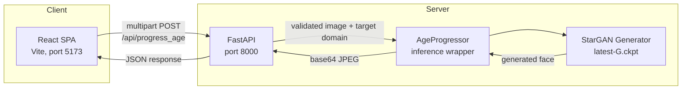
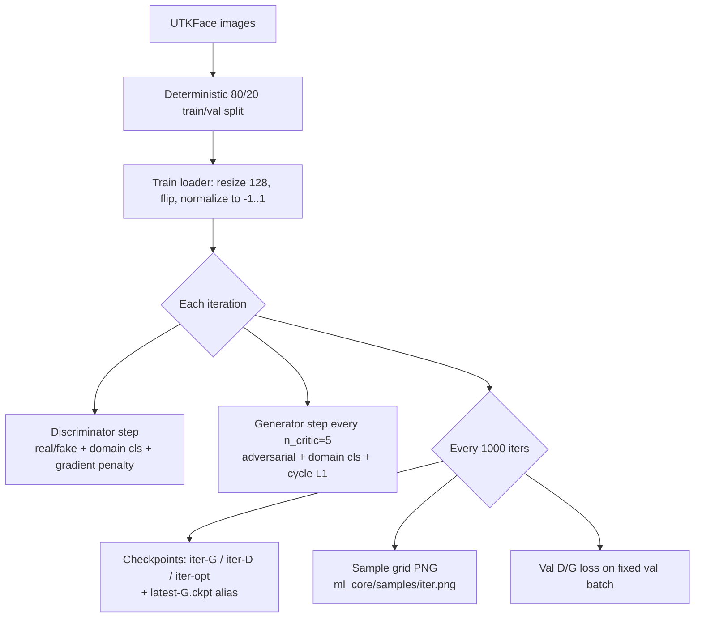

# GAN-Based Facial Age Progression and Regression

[](https://github.com/ojas3010/Major-project/actions/workflows/ci.yml)


[](LICENSE)

Identity-preserving facial age progression and regression using a multi-domain conditional GAN (StarGAN topology trained with the WGAN-GP objective) on the UTKFace dataset. A single generator handles all six age domains — no per-domain models. The trained model is served through a FastAPI backend and consumed by a React single-page dashboard.

## Contents

- [Architecture](#architecture)
- [Repository Structure](#repository-structure)
- [Setup](#setup)
- [Running the Application](#running-the-application)
- [API Reference](#api-reference)
- [Training](#training)
- [Model Details](#model-details)
- [Testing](#testing)
- [Continuous Integration](#continuous-integration)
- [License](#license)

## Architecture



The backend loads `ml_core/models/latest-G.ckpt` once at startup (FastAPI lifespan). Every request is validated (MIME type, payload size, domain range) before touching the model. Inference runs on GPU when CUDA is available, otherwise CPU.

## Repository Structure

| Path | Purpose |
|------|---------|
| `ml_core/model.py` | StarGAN Generator and Discriminator definitions |
| `ml_core/dataset.py` | UTKFace loader; maps age to 6 discrete domains |
| `ml_core/train.py` | WGAN-GP training loop: checkpointing, resume, sample grids |
| `ml_core/inference.py` | `AgeProgressor` — loads checkpoint, runs single-image inference |
| `backend/main.py` | FastAPI service with input validation and CORS |
| `frontend/` | React 19 + Vite SPA — drag-and-drop upload, result download, latency badge |
| `tests/` | pytest unit and API tests, standalone training smoke test |
| `.github/workflows/ci.yml` | CI: backend test job + frontend lint/build job |

### Age Domains

| Domain | Age range |
|--------|-----------|
| 0 | 0–10 |
| 1 | 11–20 |
| 2 | 21–30 |
| 3 | 31–40 |
| 4 | 41–50 |
| 5 | 51+ |

## Setup

Requires Python 3.12+ and Node 22+.

```bash
python -m venv .venv
source .venv/bin/activate            # Windows: .venv\Scripts\activate
pip install -r backend/requirements.txt
```

GPU users: install the CUDA build of PyTorch from [pytorch.org](https://pytorch.org) instead of the default CPU wheel.

## Running the Application

**Backend** (from repo root):

```bash
python -m uvicorn backend.main:app --port 8000
```

Model weights are loaded from `ml_core/models/latest-G.ckpt` at startup. Without a checkpoint the API still runs but produces noise output.

**Frontend**:

```bash
cd frontend
npm install
npm run dev            # http://localhost:5173
```

## API Reference

### `POST /api/progress_age`

Multipart form request.

| Field | Type | Constraints |
|-------|------|-------------|
| `file` | image | JPEG / PNG / WEBP, max 5 MB |
| `target_age_group` | integer | 0–5 (see age domain table) |

**Success** — `200`:

```json
{ "status": "success", "image_base64": "<jpeg bytes, base64>" }
```

**Errors**:

| Status | Cause |
|--------|-------|
| 400 | Unsupported file type, payload over 5 MB, or corrupt image bytes |
| 422 | `target_age_group` outside 0–5 or not an integer |
| 500 | Model not initialized or inference failure |

### `GET /`

Health check. Returns `{"message": "Age Progression GAN API is running."}`.

## Training

Place UTKFace images (filename format `[age]_[gender]_[race]_[date].jpg`) in `ml_core/data/utkface`, then run from the repo root:

```bash
python ml_core/train.py
```

### Getting the dataset

UTKFace (Aligned & Cropped Faces, ~23k images) is distributed from the [UTKFace project page](https://susanqq.github.io/UTKFace/); mirrors also exist on Kaggle. Extract the `.jpg` files directly into `ml_core/data/utkface` — the loader parses the age from each filename and silently skips files that don't match the naming scheme.

Training 100k iterations at 128px requires a CUDA GPU (roughly a day on a modern consumer card); CPU training is impractical. Without local CUDA, clone the repo on Colab/Kaggle, train there with the same command, and copy the resulting `ml_core/models/latest-G.ckpt` back for serving.

`train.py` resolves its data and output paths relative to its own location, so it works from any working directory.

### Training pipeline



### Train/val split

The loader splits the dataset 80/20 with a seeded permutation over the sorted file list, so the split is reproducible across runs — resuming training keeps the same val set. The val pipeline omits the horizontal-flip augmentation. At every checkpoint save, D and G losses on a fixed val batch are logged (the D val loss omits the gradient-penalty term, which requires gradients). Logging only — there is no early stopping.

### Checkpoints and resume

Every 1,000 iterations, `ml_core/models/` receives:

- `{iter}-G.ckpt`, `{iter}-D.ckpt` — generator / discriminator weights
- `{iter}-opt.ckpt` — both optimizer states
- `latest-G.ckpt` — stable alias the backend loads

Interrupted runs **resume automatically** from the highest-numbered checkpoint, including Adam optimizer state — just rerun the same command.

### Sample grids

At every checkpoint, a fixed batch of 8 real images is translated to all 6 age domains and saved as `ml_core/samples/{iter}.png`. Each row is one source image: original in the first column, followed by domains 0–5. Useful for visually tracking generator quality across a run.

### Key hyperparameters

| Parameter | Value |
|-----------|-------|
| Image size | 128 × 128 |
| Batch size | 8 |
| Iterations | 100,000 |
| Generator / Discriminator LR | 1e-4 (Adam, β₁ 0.5, β₂ 0.999) |
| Critic steps per generator step (`n_critic`) | 5 |
| λ classification / reconstruction / gradient penalty | 1 / 10 / 10 |

## Model Details

**Generator** — StarGAN topology: the one-hot domain label is spatially replicated and concatenated with the input image channels. 7×7 entry conv → two stride-2 downsampling convs → 6 residual blocks (instance norm) → two transposed-conv upsampling layers → 7×7 output conv with tanh. Output is in [-1, 1], denormalized at inference.

**Discriminator** — PatchGAN with two heads: a real/fake patch map (WGAN critic output) and a domain classification head over the 6 age groups.

**Objective** — WGAN-GP adversarial loss with gradient penalty, auxiliary domain classification loss on both networks, and a cycle-consistency L1 reconstruction loss (translate to target domain, translate back, compare with source) that preserves identity.

## Testing

```bash
pip install pytest httpx
python -m pytest tests -v            # 17 unit + API tests
python tests/smoke_train.py          # 10-iteration CPU training smoke test
```

The test suite covers age-group boundary mapping, dataset filename parsing (including corrupt names), one-hot encoding, generator/discriminator output shapes and bounds, end-to-end inference, and the full API validation matrix (health check, success path, bad MIME type, out-of-range and non-integer domains, oversized payload, corrupt image bytes).

The smoke test runs real training iterations on synthetic data and asserts checkpoint writing, the `latest-G.ckpt` alias, checkpoint discovery, and optimizer-state resume.

## Continuous Integration

Every push and pull request runs two jobs on GitHub Actions:

- **backend** — Python 3.12, CPU PyTorch, full pytest suite plus the training smoke test (checkpoint save + resume)
- **frontend** — Node 22, ESLint, production Vite build

## Tech Stack

| Layer | Technology |
|-------|------------|
| Model | PyTorch, torchvision |
| Serving | FastAPI, Uvicorn |
| Frontend | React 19, Vite 8 |
| Testing | pytest, httpx, GitHub Actions |

## License

Released under the [MIT License](LICENSE).
